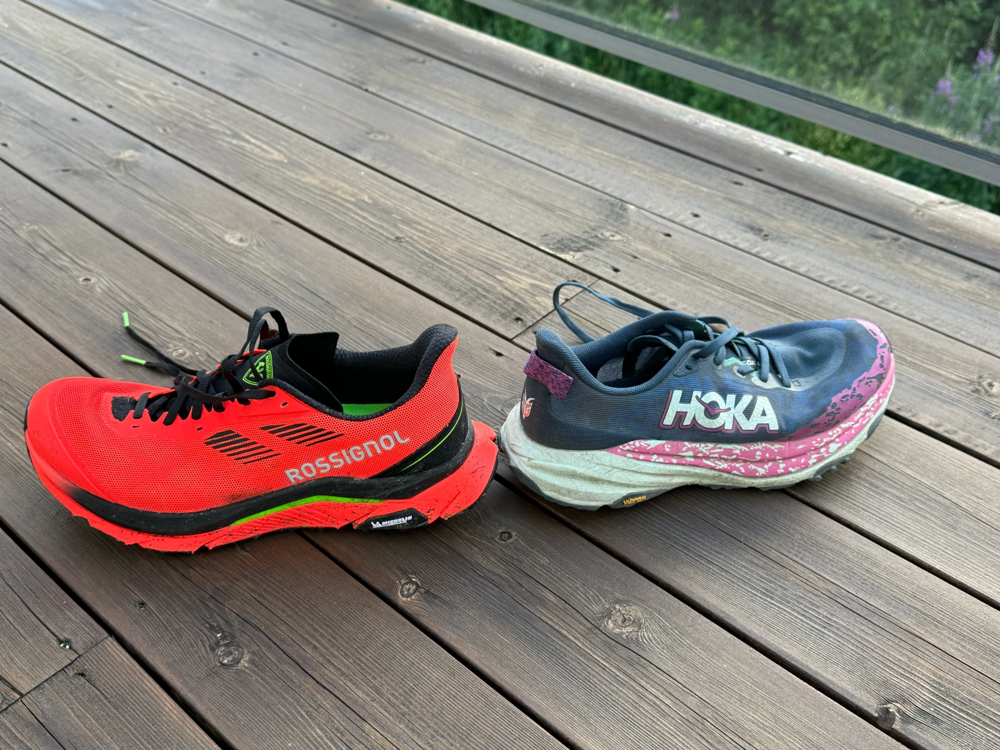
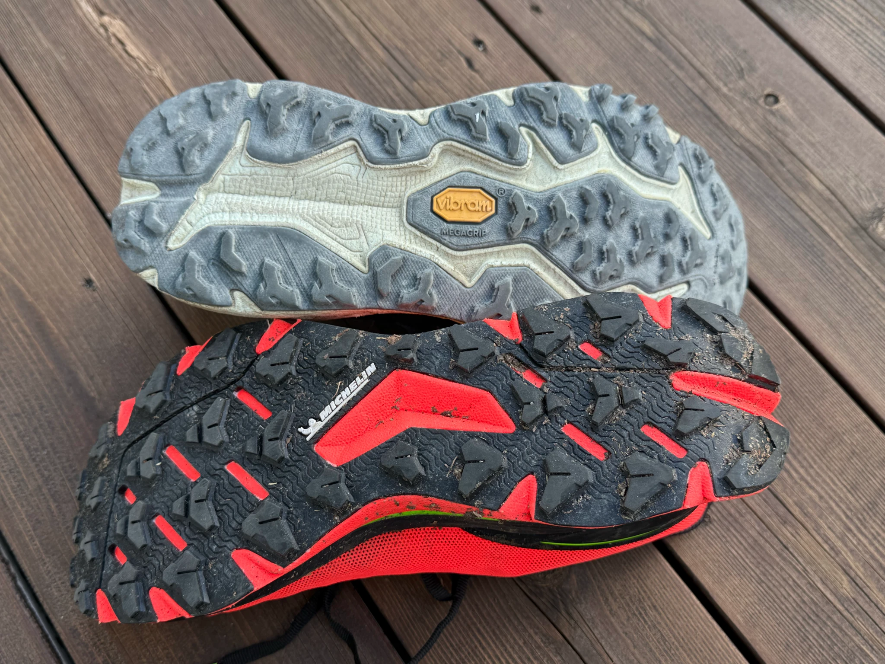

# Rossignol Vezor vs Hoka Speedgoat 6 Comparison

[Because of climate change](https://www.lemonde.fr/economie/article/2025/03/19/rossignol-victime-du-dereglement-climatique-fait-le-pari-des-sports-de-montagne-d-ete_6583470_3234.html), the ski equipment company [Rossignol entered the trail running market](https://www.rossignol.com/us-en/trail-running.html) a few months ago with a relatively high-end shoe, the Vezor.

I'm not extremely nerdy about running shoes, but the Rossignol Vezor has a plate and two layers of fancy foams, and I read that it's supposed to be pretty advanced stuff. I also know that the Hoka Speedgoat 6 is a more traditional shoe with no plates and a single layer of not so fancy foam.

Because of such differences, I guess that some people would say that you can't really compare the two shoes, and that explains why I didn't find a comparison between the two online. But they are both trail running shoes, with cushion, good grip, and a similar weight. I think it's fair to compare them, so here is a comparison.

And very importantly, Rossignol decided to sell the Vezor at a competitive price to enter the market. I paid mine 1550 NOK (with 25% VAT), about €125 (with conversion and 20% VAT), or about $125 (no VAT). The price is a bit too good to ignore, it's about the same price as the Hoka Speedgoat 6 from last year when it's on sale.

So, because my Speedgoat 6 is getting a bit used, the price is good, and I'm an immigrant originally from the same region as Rossignol, I decided to buy a pair of Rossignol Vezor to add to my rotation. But was it a good idea?

## Test Run

To test the Vezor, I went for a short run of 10 kilometres with 370 meters of D+ in Oslo's Nordmarka : Vettakollen. It features a good mix of single paths, gravel roads, dry and wet rocks, lots of roots, some mud, a steep ascent, and even a few hundred meters of asphalt. The route alternates between fast and easy sections and technical and slow sections. This is also right next to work and I only had one hour to run.

It was a summer run with a temperature of about 20 °C, just after a descent amount of rain. Some rocks exposed to the sun were already dry.

I didn't do the run with the Speedgoat 6 on the same day, but I did run the route before. And I have run the Speedgoat in the Nordmarka enough to know how it performs in similar conditions. Sorry if you wanted a more scientific test, but I don't think running the same route twice in the same day would have made the whole comparison much more scientific anyway. The conditions change fast, and my fatigue would have been different. A proper scientific test would require more runners, more routes, more conditions, and at least a notebook.

## Comfort: The Vezor Wins

It's an easy win for the Vezor, the Speedgoat 6 isn't a very comfortable shoe. It's less comfortable than the Speedgoat 5 and many people complained. I have hopes that the Speedgoat 7 will be more comfortable once it's released next year. However, the Speedgoat 6 gives a good feeling of the ground, which is something that I like.

But the Vezor is both comfortable and with a good feeling of the ground. I was surprised about the level of comfort in dry river beds for example. And it's also comfortable on asphalt.

In terms of fit, both are fine but not perfectly adapted to my feet. The Hoka is size 41 1/3 and the Rossignol is size 42. I had to go a bit up in size with the Rossignol to fit my toes, but the Hoka is a bit tight while the size above is just a bit too big. I need more money to have custom shoes moulded to my feet.

## Grip: The Speedgoat 6 Wins

Before buying the Vezor, I was worried about the grip. Grip is pretty important when trail running in the Oslo Nordmarka, it often features slippery rocks and very slippery roots. Mud is less of a problem because it's often easy to run around. When it's a lot of mud, it's likely a bog and good luck because slightly taller lugs with a different pattern won't help much.

The Speedgoat 6 has a Vibram MegaGrip sole, which is considered the best at the moment. The Vezor has a Michelin Formula sole, which is supposed to be very good too.

I heard a reviewer stating that the Michelin sole is at the Vibram MegaGrip level, but I don't think it's true. Perhaps the shoe shape and stiffness have something to do with it, but while the Vezor grip is fine, I slipped a few times during my run, which is something that happens very seldom with the Speedgoat 6.

I'm relatively lightweight, so that may highlight the lack of grip of the Vezor (more weight gives more grip). I for sure ran more carefully than on my usual runs with the Speedgoat 6. The run was pretty wet though, as it was raining a lot before I started. The test run also required a bit more good grip than the average trail run.

## Stability: The Speedgoat 6 Wins

Maybe I'm a bad trail runner and the Speedgoat allows me to run with bad technique, but I found the Vezor to be a bit unstable as it can rotate if you don't place your feet very well on rocks and roots. I read about the rotation issue before buying the Vezor, and I confirm it's there. It's apparently related to this kind of performance shoe, the plate in particular. The Speedgoat 6 is also a lot wider, which probably helps with stability.

So I won't use the Vezor for my technical runs in the future. Risking a twisted ankle is not worth it. The Vezor works very well on easy to medium trails, and I will use it for those runs. You can definitely run a technical section with the Vezor if you are careful, but if the run is mostly technical, I would go with the Speedgoat 6 instead.

## Performance: It Depends

The Vezor is my first shoe with fancy foams and a plate, and I didn't need much distance to understand why some running enthusiasts spend insane amounts of money on such high margin shoes. It works. It's bouncy, stable, it feels nice, and it's fast.

On easy trails, I feel like I can run slightly faster with the Vezor compared to the Speedgoat 6, while maintaining a good comfort level. Especially downhill, I can run pretty fast without issues.

Now, because of the lower grip level and the stability issues, I find it harder to trust the Vezor on the very technical sections. With the Hoka Speedgoat 6, you can power through the technical sections without thinking too much. It's stable and it will not slip.

Overall, looking at the segments on Strava, I have been noticeably faster with the Vezor on the technically easy segments, but my personal records on the technical segments are still with the Speedgoat 6 (though the Speedgoat 6 records were on a drier day).

## Longevity: I don't Know Yet

As I've only run 10 kilometres with the Vezor, I can't say much about the longevity. The materials seem good, and the construction quality is solid, but only time will tell. The Speedgoat 6 pictured there has 500 kilometres on it, and it's still in pretty good shape. The sole is doing much better than the (regretted) Speedgoat 5 in my opinion.

## You Should Buy the Rossignol Vezor If

- You run easy to medium trails and want a comfortable and fast pair of shoes.
- You have excellent technique and don't need a lot of grip.
- You want to support the shareholders of a struggling ski equipment French company.
- You think the Michelin logo on the sole is cool.
- You want something a bit different.

## You Should Buy the Hoka Speedgoat 6 If

- You run mostly technical trails.
- You want the best grip on the market.
- You want to trust your shoes for when you fail your foot placement.
- You don't mind being a bit slower and less comfortable.

## Perhaps Get Both

I'm happy about the Rossignol Vezor and I would say it's worth buying. I hope Rossignol will stay in this price range because I'm not ready to spend the double on alternative plastic shoes (carbon fiber is mostly plastic by the way). I will also likely continue to buy Hoka Speedgoats because they are great. And remember to buy shoes that fit your feet.
